# Temporal Databases:
## Theory and Postgres

Paul A. Jungwirth<br/>
31 May 2019<br/>
PGCon 2019

Note:

- Thanks for coming!
- I'm Paul Jungwirth....
- independent consultant/programmer from Portland, OR

- used Postgres since ~2010.
- I've done plenty of work in Oracle, MySQL, and MS SQL Server, but Postgres is by far the best.

- Humbled to be here. There lots of related work I'll mention today, and I'm amazed by all of you.
- Not a contributor but I've written a bunch of extensions.
- Since I'm from Portland: they're pretty obscure, you probably haven't heard of them.

- Actually I did dip my toe in the contributor waters a few years ago:
- I wrote a patch adding UUID support to `btree_gist`, which we'll see is actually relevant to temporal databases.
- Also I have a few patches waiting for review now for more temporal db support.
- (We'll get to those.)

- I've been interested in temporal databases for several years,
- I've read 3/4ths of the books in English and a lot of the papers.
- Almost every project I work on I wish I had easy temporal database support.
- Now that SQL:2011 has standardized some of the functionality,
  more and more vendors are supporting it,
  and I hope Postgres will too!
- I want to give an overview of temporal concepts and features,
  and then talk about SQL:2011 and Postgres.
- Finally I'll give a quick survey of SQL:2011 in the other RDBMSes out there.


# Temporal<br/>`IS DISTINCT FROM`<br/>Time-Series
<!-- .slide: style="font-size: 70%" -->

time-series | temporal
----------- | --------
single timestamp | two timestamps
records events       | records things, "versions"
IoT sensors, finance | auditing, history
challenge is scale   | challenge is complexity
partitioning         | ranges, exclusion constraints
Citus, TimescaleDB   | `temporal_tables`, Tardis

Note:

- So first of all, a temporal database is not the same as a time-series database.
- Nowadays time-series is all the rage, with web analytics, advertising, IoT sensor data.
- Temporal is something else.
- In time-series every record has a single time stamp; in temporal every record has two: start & end.
- In time-series you record events; in temporal, things (different versions throughout the thing's lifetime)
- Purposes: temporal has two: the history of changes to the database, the history of the thing "out there".
- Challenges:
  - timeseries: scale (but the structure is simpler)
  - temporal: moderate scale, but lots of complexity. Correctness is a challenge.
- Tools in Postgres:
  - timeseries: partitioning
  - temporal: ranges, exclusion constraints: very solid foundation, but no higher-level concepts yet
- Products in Postgres:
  - timeseries: Citus, TimescaleDB
  - temporal:
    - Teradata has had support for a long time
    - `temporal_tables` extension gives you one dimension (db history) but not the other (thing history).


# Temporal = Historical

<!-- .slide: style="font-size: 80%" -->
- e-commerce: product price
- real estate: house renovations <!-- .element: class="fragment" -->
- employees: position, salary, employment period <!-- .element: class="fragment" -->
- questionnaires: changing questions, options <!-- .element: class="fragment" -->

Note:

- A temporal database helps you anywhere you want to keep a history.
- Losing history is especially acute in OLTP databases where everything is normalized.
- Almost every project I see the need.
  - Today people mostly ignore the problem and tolerate the errors.
  - product price:
    - stored on your `products` table
    - when you change it, your orders don't add up any more.
    - Of course everyone knows this, so they copy the price over to the `line_items` table.
    - But this is an ad hoc solution.
    - They aren't copying:
      - the product tags,
      - which countries the product was available in,
      - the product's vendor's commission
      - cost of inventory is really hard too
    - In practice very few companies can re-generate their 2016 sales report and get the same answers as before.
  - real estate:
    - when did the property change?
  - employees
    - You can't give a database talk without an employees table.
    - You might want to know their salary history, their former positions, former projects, etc.
  - questionnaires:
    - For 20 years I've been building the same app over and over:
      - I call it "some users design forms, some users fill out forms."
      - I bet a lot of you have been building this thing too.
    - So what happens when you revise a question?
    - What if you're asking for Ethnicity and you change the possible answers?
    - In a normalized database you lose history, and sense can turn into nonsense.
- Retaining correct history requires foresight:
  - Copying product price to the line item.
  - Mayonnaise
- Even when they solve it, they aren't aware of the 30 years of research, so they apply an ad hoc solution.


# OLAP Problems Too


Note:

- Reporting databases (OLAP, data warehouses) are denormalized, so duplication helps retain historical information.
- Quintessential structure is a star schema:
  - like a spreadsheet with just one level of normalization
  - facts surrounded by dimensions
- Facts capture history because they are almost always dated.
- The dimensions don't necessarily have history.
  - product changes
  - stores come and ago and change
  - Kimball calls these "slowly-changing dimensions" (SCDs).


# "Slowly-Changing Dimensions"

- Type I: Overwrite it
- Type II: Add a Row
- Type III: Add a Column

Note:

- Slowly-changing dimensions are proof that even OLAP databases need temporal features.
- I have to credit Tom Johnston (author of two books on temporal databases) for connecting SCDs to temporal features.
  - He also brings some reality to Slowly-Changing Dimensions when he asks, "What do you mean slow?"

- Basically none of Kimball's suggestions are very good:
  - Enough to say that nowadays there are also Types 0, 1.5, 4, 5, 6, and 7!
- SKIP IT!:
  - Kimball's work is amazing: my point is just that temporal data is not just a problem for normalized schemas.

- Type I: overwrite it: ignore the problem: accept bad history.
- Type II: add a row:
  - might lose entity continuity:
    - Hopefully you have a durable key between rows, like a SKU, but then you might not.
    - Even if you do, following that link isn't likely to be supported by standard query-building GUIs that fit on top of star schemas.
- Type III: add a column:
  - one column to hold the old value, one to hold the new value.
  - dimension tables might have 20 columns, so you are going to have 40 columns now?
    - So for products you have an extra column for "prior department", "prior name", etc.
  - This only lets you remember a single change.
- Actually nowadays there are also Type 0, 4, 5, 6, and 7 SCDs!
  - Type 4: break some `products` attributes out into a separate mini-dimension.
  - Type 5: add a mini-dimension, and also a Type I outrigger to the major dimension table.
  - Type 6: add Type I attributes to a Type II dimension: in other words "current" vs "original".
    - This is a lot like Type 3, only we keep "original" instead of "prior"?
  - Type 7: Have both a Type I dimension and a Type II dimension!
  - This is getting complicated!

- The point isn't to criticize SCD,
  - but to use them as evidence that we need temporal databases, even in denormalized structures.
  - And if Facts are events, Dimensions are things, so they are a good fit for a temporal structure.
- And actually to give credit to Kimball:
  - He discusses adding start/end times to dimension rows,
    - and has some caveats about what an effective time might mean,
      - e.g. for a product whose v1 is sold after v2 is released.
    - But I feel like these are not the norm,
      - and if you're selling two versions of something at the same time it is really two separate products.


# Research

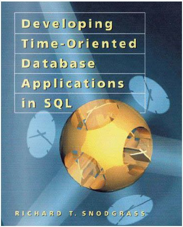

Note:

- If you want the start reading about temporal databases, this is the book.
- It even comes as a free PDF.
- From the late 90s
- Lots of SQL, including many different dialects.
- Tough to get through because of the combinatorial explosion:
  - valid-time vs system-time vs bitemporal
  - snapshot query vs sequenced vs non-sequenced
  - inner join vs outer join
  - Oracle vs DB2 vs Access vs Informix vs MS SQL Server vs UniSQL
  - SELECT vs INSERT vs UPDATE vs DELETE
- Compehensive: covers tons of ground and pulls it all together.
- Snodgrass tried to get temporal features standardized back in the 90s.
  - I was pretty annoyed to discover we could have had this stuff 20 years ago.
  - But the criticisms had some good points, and maybe the wait was worth it.


<!-- .slide: data-transition="slide none" -->
# Temporal example

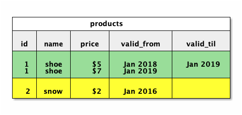

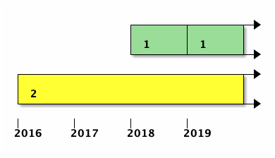

Note:

- So what does a temporal table even look like?
- It gets two extra columns for start & end time.
- Here I'm using months but it could be days, seconds, nanoseconds, or whatever.
- A blank value means unbounded or infinite.
  - You could also use sentinels like Jan 3000.
- It's nice to plot this on a timeline.

- Can't we make do with just one timestamp?
	- Just store the start date, and assume it ends when the next record starts?
	- Not really: one statement's end date is not the same as another statement's start date.
		- You could have gaps.
	- Plus a single timestamp makes it really hard to query: each row needs info from outside itself.

- Shocking that the primary key is not unique. (We'll talk more about that later.)


<!-- .slide: data-transition="none slide" -->
# Temporal example

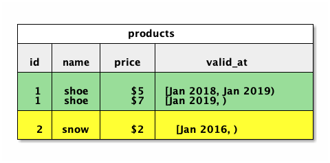


Note:

- We can make a nice refinement here.
- Postgres has built-in range types: combine two columns into one.
- They are automatically closed/open, which is the convention.
- Notation of [x,y), notation of `*---o` (algebra class).
- Closed/open makes it easy for them to "snap together", used in most of the literature.
- One disadvantage is you can't have a zero-width range: it's just a self-contradiction.
  - But why would you want that?
  - If you have duration-less time periods then really you have events: get a time-series database.
- Range types vs two columns:
  - Lots of built-in operators
  - You can have a range on any type you want.
    - Builtin date/timestamp/int, but you can define a floatrange, or even e.g. my inetrange extension.
  - Exclusion constraints: easy to index
  - Advantages indexing ranges vs a two-column btree index
    - I *think* indexing an int+range gives you faster queries than indexing an int+timestamp+timestamp,
      but I'm not sure.
    - Maybe someone here could say for sure.
    - Btw here's something I've often searched for and never found:
      - I would love to hear a talk going into the data structure differences between B-Tree, GIN, and GiST, and *why* that makes them more or less suitable to different tasks.
      - I'm especially confused because we have a built-in btree type that is different from GIN & GiST,
        but then we have extensions called `btree_gin` and `btree_gist`.


# Range Operators
<!-- .slide: style="font-size: 60%" -->

Operator | Description | Example | Result
-|-|-|-
= | equal | int4range(1,5) = '[1,4]'::int4range | t
<> | not equal | numrange(1.1,2.2) <> numrange(1.1,2.3) | t
< | less than | int4range(1,10) < int4range(2,3) | t
> | greater than | int4range(1,10) > int4range(1,5) | t
<= | less than or equal | numrange(1.1,2.2) <= numrange(1.1,2.2) | t
>= | greater than or equal | numrange(1.1,2.2) >= numrange(1.1,2.0) | t

Note:

- Ranges come with a bunch of nice operators.
- less than and greater than are not what I'd expect: they are more like alphabetical: compare the first letter, if it's tied compare the second letter.


# More Operators
<!-- .slide: style="font-size: 60%" -->

 | | |&nbsp;
-|-|-|-
@> | contains range | int4range(2,4) @> int4range(2,3) | t
@> | contains element | '[2011-01-01,2011-03-01)'::tsrange @> '2011-01-10'::timestamp | t
<@ | range is contained by | int4range(2,4) <@ int4range(1,7) | t
<@ | element is contained by | 42 <@ int4range(1,7) | f
&& | overlap (have points in common) | int8range(3,7) && int8range(4,12) | t
<< | strictly left of | int8range(1,10) << int8range(100,110) | t
>> | strictly right of | int8range(50,60) >> int8range(20,30) | t

Note:

- The `@>` and `<@` operators are some of my favorites, e.g. "was Fred employed at time t?"
- Overlap is really useful too:
  - include all the employees who were employed during 2018.


# And More
<!-- .slide: style="font-size: 60%" -->

 | | |&nbsp;
-|-|-|-
&< | does not extend to the right of | int8range(1,20) &< int8range(18,20) | t
&> | does not extend to the left of | int8range(7,20) &> int8range(5,10) | t
-&#124;- | is adjacent to | numrange(1.1,2.2) -&#124;- numrange(2.2,3.3) | t
+ | union | numrange(5,15) + numrange(10,20) | [5,20)
* | intersection | int8range(5,15) * int8range(10,20) | [10,15)
- | difference | int8range(5,15) - int8range(10,20) | [5,10)

Note:

- The "does not extend to the left/right of" operators are useful for building a temporal UPDATE trigger, although I don't know why they are negated. I've only ever used them with double negatives.

- These operators bear some resemblance to the "Allen Relationships".
- There are 13 ways that two ranges could be related to each other:
  - A before B
  - A touches B
  - A overlaps some of B
  - A overlaps all of B
  - A subsumes B
  - ...
- Everyone who talks about temporal tables brings up the Allen Relationships.
- You can read the Wikipedia page yourself.
- It's not that complicated.
- To be honest it doesn't seem worthy of getting your own Wikipedia page.
- *But* if you don't have range types and you're implementing these comparisons yourself,
  it is surprisingly hard to get them right. There are a lot of cases to cover.


# Lots easier

```
WHERE employed_during @@ [2018-01-01,2019-01-01)
```

vs

```
WHERE employed_from < '2019-01-01'
AND   '2018-01-01'  < employed_til
```

Note:

- Only two lines to do it yourself?
- But two lines are very subtle.
- To me anyway it's not obvious that that means "overlaps" and that it's correct.


# Two Dimensions
<!-- .slide: style="font-size: 60%" -->

Valid Time | Transaction Time
-----------|-----------------
history of the thing | history of the database
application features | auditing, compliance
user can edit        | immutable
maintained by your app | maintained by triggers
constraints matter | look Ma, no hands!
nothing | pg: `temporal_tables`, "A Tardis for Your ORM", `pg_audit_log`
nothing | Rails: `papertrail`, `audited`, `chronomodel`

Note:

- So far I've only talked about valid-time.
- But I mentioned there are at least two dimensions of meaningful history:
  - the thing "out there"
  - the history of changes to your database
  - Some authors propose even more dimensions.
- You could even have both dimensions for the same table!
- Then you have two start/end pairs, i.e. two ranges.
- Now it's really getting hard to understand.
- The two dimensions don't necessary have the same "physical" representation:
  - maybe the audit history is stored in a separate table.
  - maybe you have some views with instead-of triggers.
  - Snodgrass gives several implementation choices for bitemporal tables.

- I'm going to talk almost exclusively about valid-time.
  - This is the more interesting: the history of the thing.
  - But it's harder.
  - There are lots of solutions for system-time already.
    - This is maintained automatically, e.g. by triggers.
  - Valid-time is in the hands of your users: it's application-level functionality.
    - Therefore constraints are more important.


# Terminology
<!-- .slide: style="font-size: 80%" -->

|||&nbsp;
-|-|-
Snodgrass | valid time | transaction time
Fowler    | actual time | record time
Date/Darwen/Lorentzos | stated time | logged time
Johnston | effective time/<br/>state time | assertion time
SQL:2011 | application time | system time

Note:

- Btw, no one agrees on terminology.
- There is actually a document called "The Consensus Glossary of Temporal Database Concepts" . . .from 1998.


# Non-Unique PKs

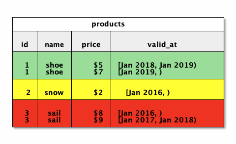

Note:

- Let's start with the simplest possible thing: primary keys!
- PKs can be non-unique, as long as their valid time doesn't overlap.
  - So product 3 in red is invalid: the two versions overlap.
  - If each row is supposed to be a true proposition,
    this is like stating a contradiction.

- But as long as the ranges don't overlap, the PK isn't unique.
- Uniqueness is a pretty foundational idea; non-unique PKs is crazy!
- No unique index will give us what we want.
  - I won't work that out, but you can try later if you want.
- A great way of thinking about this comes from....


# Another Book

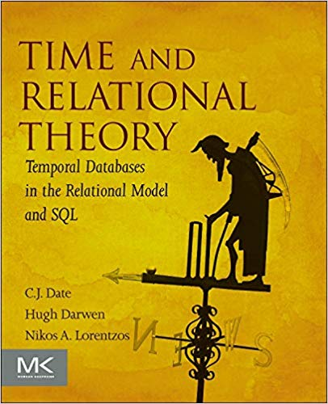

Note:

- Date/Darwen/Lorentzos: really you have one row per second, but we abbreviate it for performance and ease-of-use.
  - Then you have real unique PKs: just include the time in the PK.
  - But in the abbreviated form, we have this weird situation where there is no way to define a correct unique constraint.
- If you've ready their other books you know they are very mathematical;
 - strict purists:
 - no nulls,
 - no duplicate rows.
 - I hope you weren't expecting to see any S-Q-L!
 - This book has a similar rigor but is still very practical.
- If you read one book about temporal databases, I'd read this one.
- Also very influential on Postgres range types.
- Anyway we have this problem of non-unique primary keys, but we still want some kind of constraint....


# Exclusion constraints
<!-- .slide: data-transition="slide none" -->

```
ALTER TABLE products
ADD CONSTRAINT pk_products
EXCLUDE USING gist
(id WITH =, valid_at WITH &&);
```

Note:

- Enter Exclusion Constraints!
- Exclusion constraints are "generalized uniqueness constraints".
- There must be no other rows where all the operators evaluate to true when compared to this row.
  - If it has the same id *and* an overlapping valid time, then it's forbidden.
- (show the next slide)


# Exclusion constraints
<!-- .slide: data-transition="none none" -->

```
ALTER TABLE products
ADD CONSTRAINT pk_products
EXCLUDE
(id WITH =);
```

Note:

- Here is an exclusion constraint that enforces ordinary uniqueness.
- But exclusion constraints can do *more* than uniqueness constraints.
- (next slide)


# Exclusion constraints
<!-- .slide: data-transition="none slide" -->

```
ALTER TABLE products
ADD CONSTRAINT pk_products
EXCLUDE USING gist
(id WITH =, valid_at WITH &&);
```

Note:

- Like a uniqueness constraint, an exclusion constraint is always backed by an index to enforce it efficiently. Sometimes it can be a regular b-tree index, but when combining a scalar and a range it needs to be a GiST index like here.
- Exclusion constraints are a Postgres-only innovation.

- We could call this a "temporal primary key".
- You can do this today, but Postgres doesn't *know* that it's a so-called primay key.


# Exclusion constraints

```
CHECK (
  NOT EXISTS (
    SELECT 1
    FROM   products t1
    WHERE  1 < (
      SELECT COUNT(id)
      FROM   products t2
      WHERE  t1.id = t2.id
      AND    t1.valid_at && t2.valid_at))
  AND NOT EXISTS (
    SELECT 1
    FROM   products t3
    WHERE  p3.id IS NULL)
)
```

Note:

- Here is how Snodgrass says to do it, from the 90s before exclusion constraints.
- Actually he didn't have an overlaps operator either.
- Besides being hard to grasp and error-prone, it may not be very fast.
- Also Postgres won't let you write a `CHECK` constraint that sees more than the current row, so you need to use a trigger instead.


# Foreign Keys
<!-- .slide: data-transition="slide none" -->

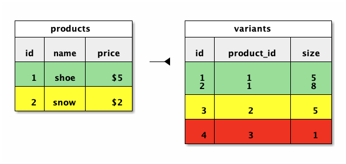

Note:

- Now that we have primary keys, let's add foreign keys.
- First let's look at *traditional* referential integrity:
- Here is a "variants" table, common in e-commerce applications.
- A product has one or more variants; every variant has a product.
- It's a basic parent-child relationship.
- Variant 4 in red is forbidden; we don't even know what kind of product it is.


# Temporal Foreign Keys
<!-- .slide: data-transition="none slide" -->

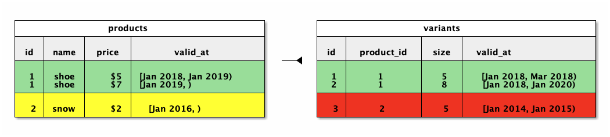

Note:

- A temporal foreign key gets a little weird, because ids are no longer unique.
- It helps to remember the Date/Darwen/Lorentzos idea of "one row per second".
  - In that case temporal foreign keys are just like regular foreign keys:
  - every instant of the child record needs a corresponding instant of the parent record.
- Variant 1 is simple: its whole lifespan is fulfilled by the product 1.
- Variant 2 is tricky: it didn't change when the product did, so its lifespan requires the *sum* of the records for product 1.
- Variant 3 is invalid: it exists before its parent record.

- I have a patch in the current Commit Fest that teaches Postgres how to implement temporal PKs and FKs.
  - No cascading DELETE/UPDATE yet:
    - I need temporal UPDATE/DELETE for that.


# Temporal Foreign Keys

```
CHECK (
  NOT EXISTS (
    SELECT 1
    FROM   variants AS v
    -- There was a p when v started:
    WHERE NOT EXISTS (
      SELECT 1
      FROM   products AS p
      WHERE  v.product_id = p.id
      AND    coalesce(lower(p.valid_at), '-infinity')
               <= coalesce(lower(v.valid_at), '-infinity')
      AND    coalesce(lower(v.valid_at), '-infinity')
               <= coalesce(upper(p.valid_at), 'infinity'))
    -- ...
```

Note:

- Snodgrass back in the 90s showed how to implement temporal foreign keys. Here it is....


# Temporal Foreign Keys

```
    -- ...
    -- There was a p when v ended:
    OR NOT EXISTS (
      SELECT 1
      FROM   products AS p
      WHERE  v.product_id = p.id
      AND    coalesce(lower(p.valid_at), '-infinity')
               < coalesce(upper(v.valid_at), 'infinity')
      AND    coalesce(upper(v.valid_at), 'infinity')
               <= coalesce(upper(p.valid_at), 'infinity'))
    -- ...
```


# Temporal Foreign Keys

```
    -- ...
    -- There are no gaps in p throughout v:
    OR EXISTS (
      SELECT 1
      FROM   products AS p
      WHERE  v.product_id = p.id
      AND    coalesce(lower(v.valid_at), '-infinity')
               < coalesce(upper(p.valid_at), 'infinity')
      AND    coalesce(upper(p.valid_at), 'infinity')
               < coalesce(upper(v.valid_at), 'infinity')
    -- ...
```


# Temporal Foreign Keys

```
    -- ...
      AND NOT EXISTS (
        SELECT 1
        FROM   products AS p2
        WHERE  p2.id = p.id
        AND    coalesce(lower(p2.valid_at), '-infinity')
                 <= coalesce(upper(p.valid_at), 'infinity')
        AND    coalesce(upper(p.valid_at), 'infinity')
                 < coalesce(upper(p2.valid_at), 'infinity')))))
```

Note:

- So obviously you don't really want to do this unless you have some help:
  - an extension or better yet native support from your database.


# Temporal Foreign Keys

<!-- .element style="width:100px; border:none" -->

```
ALTER TABLE variants
ADD CONSTRAINT tfk_variants_product_id
FOREIGN KEY (product_id, PERIOD valid_at)
REFERENCES (id, PERIOD valid_at);
```

Note:

- It's dangerous to go alone, take this.


# Queries
<!-- .slide: style="font-size: 60%" -->

|||&nbsp;
-|-|-
snapshot ("current") | at a given moment | <span style="white-space:nowrap">returns a traditional table</span><br/>(removes `valid_at`) | <code style="white-space:nowrap">WHERE valid_at @> t</code>
sequenced | across time | <span style="white-space:nowrap">returns a temporal table</span><br/>(preserves `valid_at`) | nothing, or<br/><code style="white-space:nowrap">WHERE valid_at && r</span>
non-sequenced | time is just another column | returns ??? |

Note:

- So we have these tables, and we want to query them....
- What kind of answers are we looking for?
  - "What was true at time t?" - snapshot query: result is a non-temporal relation
  - "Show me a history" - sequenced query: result is another temporal relation
- Snapshot queries are especially useful for auditing (i.e. transaction time).
  - You can judge the quality of an auditing extension by how easy it is to query the history: "Tardis" is great, `pg_audit_log` is useful but not something I'd want to query a lot.
  - Of course snapshot queries are useful for valid-time too.
- I'm not going to talk about non-sequenced queries because I've never found a plausible example of one.


# Joins
<!-- .slide: data-transition="slide none" -->

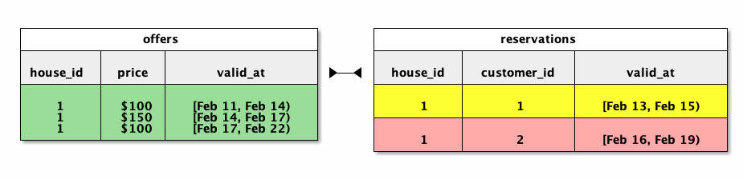

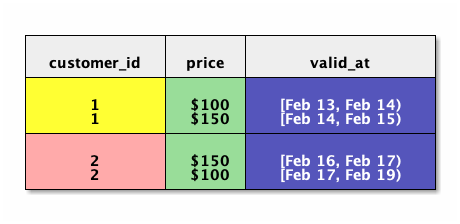<!-- .element style="visibility:hidden" -->

Note:

- If we're doing queries of course we want joins.
  - As I like to say, if you can't do joins all you have is a spreadsheet.
- But joins are where things start to get hard.
  - Ad hoc solutions uninformed by the research fall down right around here.
  - You really want a principled approach to storing and querying temporal data.
- Here you have two tables from a hospitality system.
  - I'm more or less stolen this example from some researchers in Switzerland & Italy:
    - Anton Dignös
    - Michael Böhlen
    - Johann Gamper
    - apologies for my atrocious pronunciation
  - One table for price, since that changes based on weekends, holidays, Valentine's Day.
  - Another for reservations: when is each guest staying.
  - Now we want to see what each stay costs.


# Joins
<!-- .slide: data-transition="none slide" -->


Note:

- So here is the result.
- The first customer's stay is split across two cost periods,
  - so the join for them results in two rows;
  - same for the second customer.
- Note that the timestamps are not exactly from the first table or from the second;
  - we have to cut up the input records so they align.


# Joins
<!-- .slide: data-transition="slide none" -->

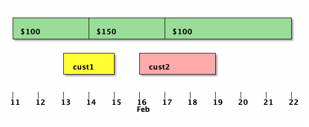

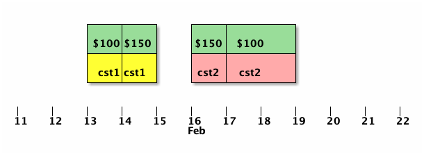<!-- .element style="visibility:hidden" -->

Note:

- It's easier to see with a timeline.
- Here are the JOINed inputs.


# Joins
<!-- .slide: data-transition="none slide" -->


Note:

- Here is your result.
- Implementing this is tough!
  - Even Snodgrass's original ideas started to fall apart somewhere around here.
    - He showed how to handle joins, but 
    - he proposed putting temporal modifiers at the *statement* level, like as part of the `SELECT` clause.
      - This means temporal stuff was outside relational theory, sort of tacked on.
      - This made it hard to have complete generality: cover all cases.
      - Result sets would have start/end quasi-columns.
        - Queries didn't compose:
          - Putting a temporal query into a view, subquery, or CTE was a problem.
          - `SELECT * FROM t`: you lose information: the result isn't `t`.

- These problems were pointed out back in the 90s by Date & co,
  - but I think they weren't really solved until recently,
  - by Anton Dignös, Michael Böhlen, and Johann Gamper, researchers in Switzerland & Italy.
    - Instead of putting temporal qualifiers at the statement level,
    - they invent temporal variants of each operator in the relational algebra.
    - They show how to easily implement temporal variants of *all* relational operators (select, project, inner join, outer join, union, intersection, etc.) with just the traditional operators plus two new transforms, which they call `NORMALIZE` and `ALIGN`. The paper is a really easy read, so you should check it out!
    - Oh and they implemented it against Postgres 9.1, then 9.5, then submitted a patch against more recent versions.
    - They got some feedback about implementing their transforms in the wrong part of the query pipeline, and they submitted a patch fixing that, but I don't think anyone has responded to that.
    - Hopefully once PG 12 ships their patch will get some attention.
      - It is way more important than mine.

- There is nothing in SQL:2011 about temporal joins.
  - You can manage to do an `INNER JOIN` with the `OVERLAPS` operator, but that's all.
  - No outer joins
  - no aggregates
  - no union/intersect/difference


# Temporal INSERT
<!-- .slide: data-transition="slide none" -->

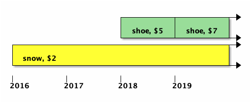

Note:

- So how do we manipulate temporal data?
- In normal databases, each row makes an assertion, typically about "now".
- In temporal databases, we assert something for a range in time.
- So we want to add that assertion.


# Temporal INSERT
<!-- .slide: data-transition="none none" -->

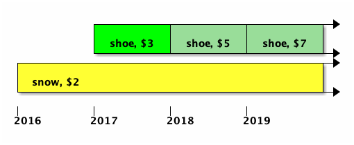

Note:

- This is a simple insert.
- Pretty simple: it works if it doesn't contradict any existing rows.


# Temporal INSERT
<!-- .slide: data-transition="none none" -->


Note:

- But suppose we were INSERTing $5.....
- This is not really what we want.


# Temporal INSERT
<!-- .slide: data-transition="none slide" -->

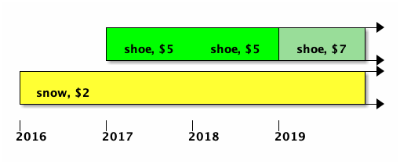

Note:

- Coalesce: we want to avoid two adjacent records that assert the same thing; we want to merge them automatically.
  - This simplifies other logic elsewhere.
- Note there aren't any more rows than before:
  - The database invisibly transforms our INSERT into an UPDATE, just moving the date of the original row.
  - If we inserted something in between two other ranges, it would even UPDATE one and DELETE the other!
- Actually SQL:2011 leaves this out
  - So maybe we could/should skip it.
  - But your table will get more & more finely chopped.
  - Maybe add an optional trigger function you can attach.
    - What to do in Postgres about columns with no equality operator, e.g. json? (Cast json to jsonb first?) But is there a general solution?


# Temporal UPDATE
<!-- .slide: data-transition="slide none" -->

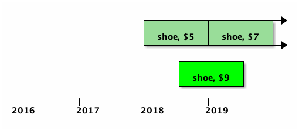

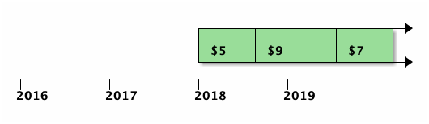<!-- .element style="visibility:hidden" -->

Note:

- We update just a selected range.
- This UPDATE causes us to update two other records and INSERT another.
- Also needs to COALESCE afterward.


# Temporal UPDATE
<!-- .slide: data-transition="none slide" -->


Note:


# Temporal UPDATE
<!-- .slide: data-transition="slide none" -->

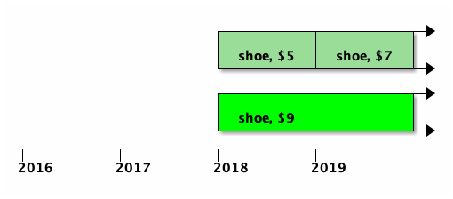

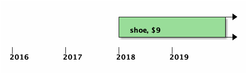<!-- .element style="visibility:hidden" -->

Note:

- Can even cause a DELETE, if our UPDATE spans multiple existing records.


# Temporal UPDATE
<!-- .slide: data-transition="none slide" -->


# Temporal DELETE
<!-- .slide: data-transition="slide none" -->

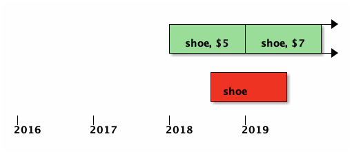

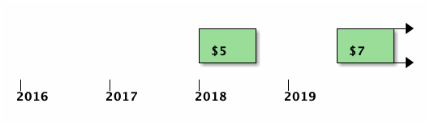<!-- .element style="visibility:hidden" -->

Note:

- Actually the delete is translated to two UPDATEs.


# Temporal DELETE
<!-- .slide: data-transition="none slide" -->


Note:

- Of course a regular DELETE is possible too.
- Even an INSERT is possible, if you DELETE in the middle of an existing record.
- So with all these INSERT/UPDATE/DELETE commands getting translated into other operations,
  which triggers fire? And on which rows? And what are their NEW/OLD values?
  Does SQL:2011 have an opinion?


# Temporal UPSERT
<!-- .slide: data-transition="slide none" -->

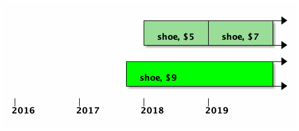

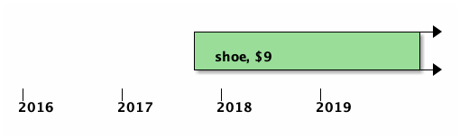<!-- .element style="visibility:hidden" -->

Note:

- aka `MERGE`
- It's really useful!
  - In a real application I built that lets you edit history this is what I used.
  - If this were an INSERT it would violate our primary key.
  - If this were an UPDATE it would lose the beginning.
- Nothing about this in SQL:2011
- Johnston calls this an `INSERT WHENEVER`
- Postgres's own `INSERT ON CONFLICT` won't help you here,
  - but I think we could teach it to.


# Temporal UPSERT
<!-- .slide: data-transition="none slide" -->


Note:

- Despite all this research on temporal databases, going back 3+ decades, there is almost no "full stack" research:
  - What is a good UX to let people edit the history of something?
    - See a list of "versions".
    - Merge two versions?
    - Change the transition date?
    - Cut off a version ("delete")?
    - Wipe out the whole record completely, for all time?
    - Save all the attributes at once (perfect for `UPSERT`), or save one attribute across multiple versions?
    - Do you need a save button, or can it work with save-as-you-type?
    - It's really complicated!
  - extensions to CRUD? REST?
  - Nice ORM presentation? (Martin Fowler, object models)
  - Transactions


# SQL:2011

Note:

- Okay, let's talk about SQL:2011!


# Range
<!-- .slide: data-transition="slide none" -->

```sql
CREATE TABLE products (
  id       integer,
  valid_at tstzrange,

  name     text,
  price    decimal(10,2),

  CONSTRAINT pk_products
    EXCLUDE
    (id WITH =, valid_at WITH &&)
);
```

Note:

- We've already seen this table.
- This is our DIY temporal primary key.
- But it's a shame that Postgres doesn't *know* it's a primary key.
- We're missing this higher-level concept of PKness.


# PERIOD
<!-- .slide: data-transition="none slide" -->

```sql
CREATE TABLE products (
  id         integer,
  valid_from timestamptz NOT NULL,
  valid_til  timestamptz NOT NULL,

  name       text,
  price      decimal(10,2),

  PERIOD FOR valid_at
    (valid_from, valid_til),
  CONSTRAINT pk_products
    PRIMARY KEY
    (id, valid_at WITHOUT OVERLAPS)
);
```

Note:

- SQL:2011 doesn't have range types,
  so they added this idea of a "period".
- You see that you have separate start/end times,
  and you declare the PERIOD as a quasi-column.
- Then you make a primary key with `WITHOUT OVERLAPS`.

- Pretty nice that we have temporal primary keys.
- But having a quasi-column is a lot of trouble.


# PERIODS

```sql
SELECT * FROM t;
```

Note:

- PERIODs are not part of relational theory.
  - Date/Darwen/Lorentzos hate this.
  - Problems for composing, like putting a query into a view, or a subquery, or a CTE.
- This loses the PERIOD, but it doesn't lose ranges.
- Ranges have a richer set of operators.
- PERIODs are limited to dates and times, but ranges can be on anything.
- PERIODs don't permit a NULL to mean "unbounded";
  you have to use something like 3000 A.D.
  - (In Postgres dates & times technically have `-Infinity` and `Infinity`,
    although I've found these are not always so well-supported in client programming languages and their database libraries.)
- You can make GiST indexes on ranges, and make exclusion constraints.
- Implementation is probably a chore too:
  - Everywhere Postgres accepts a column, we'd have to accept a column or a PERIOD.
    - So SELECT, WHERE, GROUP BY, HAVING, function arguments, some DDL commands (indexes, constraints)
  - Just my impression; maybe others know better.
- Supposedly the standard authors added `PERIOD` so that RDMBS vendors and tooling vendors wouldn't have to add new column types, but adding a whole new not-exactly-a-column thing seems way worse.


# Ranges

```sql
CREATE TABLE products (
  id       integer,
  valid_at tstzrange,

  name     text,
  price    decimal(10,2),

  CONSTRAINT pk_products
    PRIMARY KEY
    (id, valid_at WITHOUT OVERLAPS)
);
```

Note:

- In my own patch I accept ranges where the standard accepts PERIODs.
- I'd like to support both PERIODs and ranges.
- Since the PERIOD name must not conflict with any column names,
  it's easy to accept both without ambiguity.
- Implementation will probably use ranges with exclusion constraints regardless.
- Vik Fearing already has a patch that lets you declare PERIODs, but not use them.


# DML

```sql
INSERT INTO products (id, price, valid_at)
VALUES (1, 5, tstzrange(.....);

UPDATE products
FOR PORTION OF valid_at FROM t1 TO t2
SET price = 4
WHERE id = 1;

DELETE FROM products
FOR PORTION OF valid_at FROM t1 TO t2
WHERE id = 1;
```

Note:

- Here is what temporal DML looks like.
- No change to INSERT.
  - Whether it's two timestamp columns or a single range column, no new syntax is needed.
- `FOR PORTION OF` for UPDATE and DELETE.
- This syntax requires separate start and end times, but it'd be nice to support ranges there too.
- You can't SET the start & end times when doing an UPDATE FOR PORTION OF (which seems reasonable).


# System Time

```sql
CREATE TABLE products (
  id       integer,
  sys_from timestamp GENERATED ALWAYS AS ROW START,
  sys_til  timestamp GENERATED ALWAYS AS ROW END,

  name       text,
  price      decimal(10,2),

  PERIOD FOR SYSTEM_TIME
    (sys_from, sys_til)
) WITH SYSTEM VERSIONING;
```

Note:

- I've totally ignored the second dimension: system time, but SQL:2011 has that too.
- You add these `GENERATED` columns (which we support now!),
- then you define a period with the magic name `SYSTEM_TIME`,
- and you say the table has `SYSTEM VERSIONING`.
- Then you get automatic transaction-time history.
- DML (insert/update/delete) works just like a non-temporal table.


# System Time

```sql
SELECT *
FROM   products
FOR SYSTEM_TIME AS OF t;

SELECT *
FROM   products
FOR SYSTEM_TIME FROM t1 TO t2;
```

Note:

- You can query at a given point in time, or for a given range.
- You can always say `BETWEEN t1 AND t2` instead of `FROM t1 TO t2`,
  and you get closed/closed instead of closed/open semantics.


# MariaDB

```sql
CREATE TABLE products (
  id    integer,
  name  text,
  price decimal(10,2)
) WITH SYSTEM VERSIONING;

SELECT *, row_start, row_end FROM products;
```

Note:

- Supports the standard syntax,
- and also this abbreviated syntax.
  - Gives you pseudo-columns `row_start` and `row_end`.
- I don't know what the system catalog says for a table like this.
- Btw MariaDB and MySQL don't support valid-time PERIODs yet.
  - Still the theme of database auditing but not entity history!


# Oracle

```sql
ALTER DATABASE ADD SUPPLEMENTAL LOG DATA;

SELECT * FROM t AS OF TIMESTAMP t;
```

Note:

- Here is how Oracle does system-time tables.
- Oracle 12c
- Just based on reading the docs.
- Lots of other commands to set it up.
- Nothing like the SQL:2011 syntax.


# Oracle
<!-- .slide: style="font-size: 90%" -->

```sql
CREATE TABLE products (
  id         int,
  valid_from timestamp,
  valid_til  timestamp,

  name  text,
  price decimal(10,2),

  PERIOD FOR valid_at (valid_from, valid_til)
);

SELECT * FROM products
AS OF PERIOD FOR valid_at t;

SELECT * FROM products
VERSIONS PERIOD FOR valid_at BETWEEN t1 AND t2;
```

Note:

- Also valid time!
- Note the "FOR" in the `PERIOD` use. (Easier for the parser?)
- According to the docs the constituent columns can be nullable, although the standard says they must be `NOT NULL`. I *think* this just means that it automatically not-null-icates them, like you'd do with a PRIMARY KEY.


# MS SQL Server
<!-- .slide: style="font-size: 90%" -->

```sql
CREATE TABLE dbo.Products (
  Id      integer PRIMARY KEY CLUSTERED,
  SysFrom datetime2(2) GENERATED ALWAYS AS ROW START,
  SysTil  datetime2(2) GENERATED ALWAYS AS ROW END,
  Name    text,
  Price   decimal(10, 2),
  PERIOD FOR SYSTEM_TIME (SysFrom, SysTil)
) WITH (
  SYSTEM_VERSIONING = ON
    (HISTORY TABLE = dbo.ProductsHistory)
);
```

Note:

- Available in SQL Server 2016.
- You create your product table with the usual `SYSTEM_TIME` `PERIOD`.
- Then you use this second command to give it system versioning,
  naming the table where the old versions go.
  - This is a very reasonable implementation for system-time information IMO.
  - `temporal_tables` and "Tardis for your ORM" take this approach too.
  - Maybe it'd be nice if it weren't quite so exposed.
- So I guess you query that table if you want old information.
- I haven't tested this myself.
- Also interesting: you can make the `SysFrom` and `SysTil` columns `HIDDEN` so they aren't included in `SELECT *`---just like the `PERIOD`!
- No support for valid-time `PERIOD`s.
- If someone says, "Everyone else already supports SQL:2011 temporal tables; why are you so slow Postgres?"
  - Yeah, they support the boring parts.


# IBM DB2

```sql
CREATE TABLE products (
  id       int,
  sys_from timestamp(12) GENERATED ALWAYS AS ROW BEGIN,
  sys_til  timestamp(12) GENERATED ALWAYS AS ROW END,
  tx_id    timestamp(12) GENERATED ALWAYS AS TRANSACTION START ID,

  name  text,
  price decimal(10,2),

  PERIOD SYSTEM_TIME (sys_from, sys_til)
);
```

Note:

- System time
- No need for `WITH SYSTEM VERSIONING`.
- Note `BEGIN` vs `START` in SQL:2011/MariaDB/SQL Server.
- What is `tx_id` about?


# IBM DB2

```sql
CREATE TABLE products (
  id         int,
  valid_from timestamp(12) NOT NULL,
  valid_til  timestamp(12) NOT NULL,

  name  text,
  price decimal(10,2),

  PERIOD BUSINESS_TIME (valid_from, valid_til)
);
```

Note:

- Supports valid-time!


# Postgres?

```sql
CREATE TABLE products (
  id         integer,
  claimed_at tstzrange GENERATED ALWAYS AS ROW RANGE,
  name       text,
  price      decimal(10,2)
) WITH SYSTEM VERSIONING (claimed_at);
```

Note:

- I've talked about valid-time syntax, but maybe our range-friendly system-time syntax would look like this.


# Thanks!
<!-- .slide: style="font-size: 30%" -->

#### Me

- https://github.com/pjungwir/temporal-databases-postgres-talk
- https://illuminatedcomputing.com/posts/2017/12/temporal-databases-bibliography/

#### Research

- https://www2.cs.arizona.edu/~rts/publications.html
- http://citeseerx.ist.psu.edu/viewdoc/download;jsessionid=F78723B857463955C76E540DCAB8FDF5?doi=10.1.1.116.7598&rep=rep1&type=pdf
- https://files.ifi.uzh.ch/boehlen/Papers/modf174-dignoes.pdf
- http://www.zora.uzh.ch/id/eprint/130374/1/Extending_the_kernel.pdf

#### SQL:2011

- https://www.wiscorp.com/SQLStandards.html
- https://sigmodrecord.org/publications/sigmodRecord/1209/pdfs/07.industry.kulkarni.pdf

#### Other Vendors

- https://mariadb.com/kb/en/library/system-versioned-tables/
- https://docs.oracle.com/database/121/ADFNS/adfns_flashback.htm#ADFNS610
- https://docs.oracle.com/database/121/ADFNS/adfns_design.htm#ADFNS967
- https://docs.microsoft.com/en-us/sql/relational-databases/tables/temporal-tables?view=sql-server-2017
- https://www.ibm.com/support/knowledgecenter/en/SSEPGG_10.1.0/com.ibm.db2.luw.admin.dbobj.doc/doc/t0058926.html

#### Patches

- https://www.postgresql-archive.org/PROPOSAL-Temporal-query-processing-with-range-types-tt5913058.html
- https://www.postgresql-archive.org/SQL-2011-PERIODS-vs-Postgres-Ranges-tt6055264.html

#### Tools

- https://github.com/arkhipov/temporal_tables
- https://www.youtube.com/watch?v=TRgni5q0YM8
- https://github.com/ifad/chronomodel

Note:

- The slides are on Github and include my speaker notes, so hopefully they are more useful than just the pictures.


# Thanks!

https://github.com/pjungwir/temporal-databases-postgres-talk
