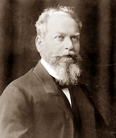

# Temporal Databases:
## Theory and Postgres

Paul A. Jungwirth<br/>
21 February 2019<br/>
pdxpug


# Temporal<br/>`IS DISTINCT FROM`<br/>Time-Series
<!-- .slide: style="font-size: 70%" -->

time-series | temporal
----------- | --------
records events       | records things
IoT sensors, finance | auditing, history
challenge is scale   | challenge is complexity
Partitioning         | ranges, exclusion constraints
Influx               | Datomic, Oracle, DB2, MySQL
Citus, TimescaleDB   | Teradata, `temporal_tables`


# Temporal = Historical

<!-- .slide: style="font-size: 80%" -->
- e-commerce: product price
- e-commerce: product vendor shipping options <!-- .element: class="fragment" -->
- e-commerce: product searchable description <!-- .element: class="fragment" -->
- real estate: house renovations <!-- .element: class="fragment" -->
- employees: position, salary, employment period <!-- .element: class="fragment" -->
- questionnaires: changing questions, options <!-- .element: class="fragment" -->

Note:

- Accidentally changing history is especially acute in OLTP databases where everything is normalized.
- Almost every project I see the need.
  - show slides
  - Also apparently agriculture: Snodgrass has the cattle example, Date & Darwen teamed up with Lorentzos at the Agricultural University of Agriculture, and a temporal Rails plugin is by the Italian Fund for Agricultural Development. I don't know why temporal databases are so popular among ag people.
- Today people just tolerate the errors, e.g. you can't generate your 2014 sales report and get the same numbers as before.


<!-- .slide: data-transition="slide none" -->
# OLAP Problems Too


<!-- .slide: data-transition="none slide" -->
# OLAP Problems Too


Note:

- Reporting databases (OLAP, data warehouses) are denormalized, so duplication helps retain historical information.
- Quintessential structure is a star schema:
  - like a spreadsheet with just one level of normalization
  - facts surrounded by dimensions
- Facts capture history because they are almost always dated.
- The dimensions don't necessarily


# "Slowly-Changing Dimensions"

- Type I: Overwrite it
- Type II: Add a Row
- Type III: Add a Column

Note:

- Type I: overwrite it: ignore the problem: accept bad history.
- Type II: add a row:
  - might lose entity continuity:
    - Hopefully you have a durable key between rows, like a SKU, but then you might not.
    - Even if you do, following that link isn't likely to be supported by standard query-building GUIs that fit on top of star schemas.
- Type III: add a column:
  - one column to hold the old value, one to hold the new value.
  - dimension tables might have 20 columns, so you are going to have 40 columns now?
    - So for products you have an extra column for "prior department", "prior name", etc.
  - This only lets you remember a single change.
- Actually nowadays there are also Type 0, 4, 5, 6, and 7 SCDs!
  - Type 4: break some `products` attributes out into a separate mini-dimension.
  - Type 5: add a mini-dimension, and also a Type I outrigger to the major dimension table.
  - Type 6: add Type I attributes to a Type II dimension: in other words "current" vs "original".
    - This is a lot like Type 3, only we keep "original" instead of "prior"?
  - Type 7: Have both a Type I dimension and a Type II dimension!
  - This is getting complicated!

- I have to credit Tom Johnston for making this criticism and connecting it to temporal databases.
  - He also brings some reality to Slowly-Changing Dimensions when he asks, "What do you mean slow?"

- The point isn't to criticize SCD,
  - but to use them as evidence that we need temporal databases, even in denormalized structures.
  - And if Facts are events, Dimensions are things, so they are a good fit for a temporal structure.
- And actually to give credit to Kimball:
  - He discusses adding start/end times to dimension rows,
    - and has some caveats about what an effective time might mean,
      - e.g. for a product whose v1 is sold after v2 is released.
    - But I feel like these are not the norm,
      - and if you're selling two versions of something at the same time it is really two separate products.


# Research


Note:

- From the late 90s
- Lots of SQL


# Temporal example


Note:

- Each row gets an extra start & end time.
- Here I'm using months but it could be days, seconds, nanoseconds, or whatever.
- A blank value means unbounded or infinite.
- We can imagine these on a timeline.

- Can't we make do with just one timestamp?
	- Just store the start date, and assume it ends when the next record starts?
	- Not really: one statement's end date is not the same as another statement's start date.
		- You could have gaps.
	- Plus a single timestamp makes it really hard to query: each row needs info from outside itself.


# Valid-at Ranges


<!--
<pre style="margin:0 auto; width:60%; background-color:white">

                    <span style="color:#00aa00">1</span>
                    <span style="color:#00aa00">*-------o</span>
                            <span style="color:#00aa00">*-----></span>
    <span style="color:#bbaa44">2</span>
    <span style="color:#bbaa44">*-----------------------------></span>
    <span style="color:#333333">|       |       |       |
    2016    2017    2018    2019</span>

</pre>
-->

Note:

- Postgres has built-in range types.
- They are automatically closed/open, which is the convention.
- Notation of [x,y), notation of `*---o` (algebra class).
- Closed/open makes it easy for them to "snap together", used in most of the literature.
- One disadvantage is you can't have a zero-width range: it's just a self-contradiction. But why would you want that?
- Range types vs two columns:
  - Lots of built-in operators (slide?)
  - You can have a range on any type you want.
    - Builtin date/timestamp/int, but you can define a floatrange, or even e.g. my inetrange extension.
  - Exclusion constraints: easy to index
  - Advantages indexing ranges vs a two-column btree index?


# Range Operators
<!-- .slide: style="font-size: 60%" -->

Operator | Description | Example | Result
-|-|-|-
= | equal | int4range(1,5) = '[1,4]'::int4range | t
<> | not equal | numrange(1.1,2.2) <> numrange(1.1,2.3) | t
< | less than | int4range(1,10) < int4range(2,3) | t
> | greater than | int4range(1,10) > int4range(1,5) | t
<= | less than or equal | numrange(1.1,2.2) <= numrange(1.1,2.2) | t
>= | greater than or equal | numrange(1.1,2.2) >= numrange(1.1,2.0) | t

Note:

- less than and greater than are not what I'd expect: they are more like alphabetical: compare the first letter, if it's tied compare the second letter.


# More Operators
<!-- .slide: style="font-size: 60%" -->

 | | |&nbsp;
-|-|-|-
@> | contains range | int4range(2,4) @> int4range(2,3) | t
@> | contains element | '[2011-01-01,2011-03-01)'::tsrange @> '2011-01-10'::timestamp | t
<@ | range is contained by | int4range(2,4) <@ int4range(1,7) | t
<@ | element is contained by | 42 <@ int4range(1,7) | f
&& | overlap (have points in common) | int8range(3,7) && int8range(4,12) | t
<< | strictly left of | int8range(1,10) << int8range(100,110) | t
>> | strictly right of | int8range(50,60) >> int8range(20,30) | t

Note:

- The `@>` and `<@` operators are some of my favorites, e.g. "was Fred employed at time t?"


# And More
<!-- .slide: style="font-size: 60%" -->

 | | |&nbsp;
-|-|-|-
&< | does not extend to the right of | int8range(1,20) &< int8range(18,20) | t
&> | does not extend to the left of | int8range(7,20) &> int8range(5,10) | t
-&#124;- | is adjacent to | numrange(1.1,2.2) -&#124;- numrange(2.2,3.3) | t
+ | union | numrange(5,15) + numrange(10,20) | [5,20)
* | intersection | int8range(5,15) * int8range(10,20) | [10,15)
- | difference | int8range(5,15) - int8range(10,20) | [5,10)

Note:

- The "does not extend to the left/right of" operators are useful for building a temporal UPDATE trigger, although I don't know why they are negated. I've only ever used them with double negatives.


# Lots easier

```
WHERE employed_during @@ [2018-01-01,2019-01-01)
```

vs

```
WHERE employed_from < '2019-01-01'
AND   '2018-01-01'  < employed_til
```


# Non-Unique PKs


Note:

- PKs can be non-unique, as long as their valid time doesn't overlap.
- Uniqueness is a pretty foundational idea; non-unique PKs is crazy!
- No unique index will give us what we want.
- Date/Darwen/Lorentzos: really you have one row per second, but we abbreviate it for performance and ease-of-use.


# Another Book


Note:

- Also very influential on Postgres range types.
- Very mathematical; Date & Darwen in their other books are strict purists: no nulls, no duplicate rows. I hope you weren't expecting to see any S-Q-L! This book has a similar rigor but is still very practical.
- Anyway we have this problem of non-unique primary keys, but we still want some kind of constraint....


# Exclusion constraints
<!-- .slide: data-transition="slide none" -->

```
ALTER TABLE products
ADD CONSTRAINT pk_products
EXCLUDE USING gist
(id WITH =, valid_at WITH &&);
```

Note:

- We could call this a "temporal primary key".
- Exclusion constraints are "generalized uniqueness constraints".
- Exclusion constraints forbid any other row from evaluating to true on *all* the operators in its list. So it's okay if another row has an equal id, as long as its valid time doesn't overlap. And it's okay if another row has an overlapping valid time, as long as its id is different. But if another row has the same id and overlaps, that's not allowed.
- You can see how you can always use an exclusion constraint in place of a uniqueness constraint: (flip to the next slide) But you can't go the other way. Exclusion constraints add something "new" to relational databases.
- Like a uniqueness constraint, an exclusion constraint is always backed by an index to enforce it efficiently. Sometimes it can be a regular b-tree index, but when combining a scalar and a range it needs to be a GiST index like here.
- As far as I know exclusion constraints are a Postgres-only innovation.


# Exclusion constraints
<!-- .slide: data-transition="none slide" -->

```
ALTER TABLE products
ADD CONSTRAINT pk_products
EXCLUDE
(id WITH =);
```


# Exclusion constraints

```
CHECK (
  NOT EXISTS (
    SELECT 1
    FROM   products t1
    WHERE  1 < (
      SELECT COUNT(id)
      FROM   products t2
      WHERE  t1.id = t2.id
      AND    t1.valid_at && t2.valid_at))
  AND NOT EXISTS (
    SELECT 1
    FROM   products t3
    WHERE  p3.id IS NULL)
)
```

Note:

- Here is how Snodgrass says to do it, from the 90s before exclusion constraints.
- Actually he didn't have an overlaps operator either.
- Besides being hard to grasp and error-prone, it may not be very fast.
- Also Postgres won't let you write a `CHECK` constraint that sees more than the current row, so you need to use a trigger instead.


# Temporal Foreign Keys
<!-- .slide: data-transition="slide none" -->


Note:

- First let's look at traditional referential integrity:
- Here is a "variants" table, common in e-commerce applications.
- A product has one or more variants; every variant has a product.
- It's a basic parent-child relationship.
- Variant 4 in red is forbidden; we don't even know what kind of product it is.


# Temporal Foreign Keys
<!-- .slide: data-transition="none slide" -->


Note:

- A temporal foreign key gets a little weird, because ids are no longer unique.
- It helps to remember the Date/Darwen/Lorentzos idea of "one row per second".
  - In that case temporal foreign keys are just like regular foreign keys:
  - every instant of the child record needs a corresponding instant of the parent record.
- Variant 1 is simple: its whole lifespan is fulfilled by the product 1.
- Variant 2 is tricky: it didn't change when the product did, so its lifespan requires the *sum* of the records for product 1.
- Variant 3 is invalid: it exists before its parent record.


# Temporal Foreign Keys

```
CHECK (
  NOT EXISTS (
    SELECT 1
    FROM   variants AS v
    -- There was a p when v started:
    WHERE NOT EXISTS (
      SELECT 1
      FROM   products AS p
      WHERE  v.product_id = p.id
      AND    coalesce(lower(p.valid_at), '-infinity')
               <= coalesce(lower(v.valid_at), '-infinity')
      AND    coalesce(lower(v.valid_at), '-infinity')
               <= coalesce(upper(p.valid_at), 'infinity'))
    -- ...
```

Note:

- Snodgrass back in the 90s showed how to implement temporal foreign keys. Here it is....


# Temporal Foreign Keys

```
    -- ...
    -- There was a p when v ended:
    OR NOT EXISTS (
      SELECT 1
      FROM   products AS p
      WHERE  v.product_id = p.id
      AND    coalesce(lower(p.valid_at), '-infinity')
               < coalesce(upper(v.valid_at), 'infinity')
      AND    coalesce(upper(v.valid_at), 'infinity')
               <= coalesce(upper(p.valid_at), 'infinity'))
    -- ...
```


# Temporal Foreign Keys

```
    -- ...
    -- There are no gaps in p throughout v:
    OR EXISTS (
      SELECT 1
      FROM   products AS p
      WHERE  v.product_id = p.id
      AND    coalesce(lower(v.valid_at), '-infinity')
               < coalesce(upper(p.valid_at), 'infinity')
      AND    coalesce(upper(p.valid_at), 'infinity')
               < coalesce(upper(v.valid_at), 'infinity')
    -- ...
```


# Temporal Foreign Keys

```
    -- ...
      AND NOT EXISTS (
        SELECT 1
        FROM   products AS p2
        WHERE  p2.id = p.id
        AND    coalesce(lower(p2.valid_at), '-infinity')
                 <= coalesce(upper(p.valid_at), 'infinity')
        AND    coalesce(upper(p.valid_at), 'infinity')
                 < coalesce(upper(p2.valid_at), 'infinity')))))
```

Note:

- So obviously you don't really want to do this unless you have some help:
  - an extension or better yet native support from your database.


# Two Dimensions
<!-- .slide: style="font-size: 60%" -->

Valid Time | Transaction Time
-----------|-----------------
history of the thing | history of the database
application features | auditing, compliance
user can edit        | immutable
maintained by your app | maintained by triggers
constraints matter | look Ma, no hands!
nothing | pg: `temporal_tables`, "A Tardis for Your ORM", `pg_audit_log`
nothing | Rails: `papertrail`, `audited`, `chronomodel`

Note:

- You could even have both dimensions for the same table!
- Then you have two start/end pairs, i.e. two ranges.
- Now it's really getting hard to understand.
- The two dimensions don't necessary have the same "physical" representation:
  - maybe the audit history is stored in a separate view.
  - Snodgrass gives several implementation choices for bitemporal tables.


# Terminology
<!-- .slide: style="font-size: 80%" -->

|||&nbsp;
-|-|-
Snodgrass | valid time | transaction time
Fowler    | actual time | record time
Date/Darwen/Lorentzos | stated time | logged time
Johnston | effective time/<br/>state time | assertion time
SQL:2011 | application time | system time

Note:

- No one agrees
- There is actually a document called "The Consensus Glossary of Temporal Database Concepts" . . .from 1998.
- I've mostly talked about valid time, and I'll just focus on that going forward.
- Transaction time is a little bit boring to me.


# Queries
<!-- .slide: style="font-size: 60%" -->

|||&nbsp;
-|-|-
snapshot ("current") | at a given moment | <span style="white-space:nowrap">returns a traditional table</span><br/>(removes `valid_at`) | <code style="white-space:nowrap">WHERE valid_at @> t</code>
sequenced | across time | <span style="white-space:nowrap">returns a temporal table</span><br/>(preserves `valid_at`) | nothing, or<br/><code style="white-space:nowrap">WHERE valid_at && r</span>
non-sequenced | time is just another column | returns ??? |

Note:

- Snapshot queries are especially useful for auditing (i.e. transaction time).
  - You can judge the quality of an auditing extension by how easy it is to query the history: "Tardis" is great, `pg_audit_log` not so great.
  - Of course snapshot queries are useful for valid-time too.


# Joins
<!-- .slide: data-transition="slide none" -->


<!-- .element style="visibility:hidden" -->

Note:

- Here you have two tables from a hospitality system.
  - One for price, since that changes based on weekends, holidays, Valentine's Day.
  - Another for reservations: when is each guest staying.
  - Now we want to see what each stay costs.


# Joins
<!-- .slide: data-transition="none slide" -->


Note:

- So here is the result.
- The first customer's stay is split across two cost periods,
  - so the join for them results in two rows;
  - same for the second customer.
- Note that the timestamps are not exactly from the first table or from the second;
  - we have to cut up the input records so they align.


# Joins
<!-- .slide: data-transition="slide none" -->


<!-- .element style="visibility:hidden" -->

Note:

- It's easier to see with a timeline.


# Joins
<!-- .slide: data-transition="none slide" -->


Note:

- Joins is where a systematic, rigorous approach really matters.
  - papertrail gem: associations not really supported.
    - These days it's in a separate gem, with a lot of limitations,
      - e.g. only one level of association,
      - can raise an error,
      - won't let you change a foreign key, ...
  - If you don't have joins, you really just have a spreadsheet.

  - Even Snodgrass's original ideas started to fall apart somewhere around here.
    - He showed how to handle joins, but 
    - he proposed putting temporal modifiers at the *statement* level, like as part of the `SELECT` clause.
      - This means temporal stuff was outside relational theory, sort of tacked on.
      - This made it hard to have complete generality: cover all cases.
      - Result sets would have start/end quasi-columns.
        - Queries didn't compose:
          - Putting a temporal query into a view, subquery, or CTE was a problem.
          - `SELECT * FROM t`: you lose information: the result isn't `t`.
            - This also drops constraints like `NOT NULL`.
              - I'd love to see a SQL paper where everything is `NOT NULL`, but you have Maybe types.
            - But it also loses the temporal information.

- These problems were pointed out back in the 90s by Date & co,
  - but I think they weren't really solved until recently,
  - by Anton Dignös, Michael Böhlen, and Johann Gamper, researchers in Switzerland & Italy.
    - I'm stealing this example from their paper, sort of.
    - Instead of putting temporal qualifiers at the statement level,
    - they invent temporal variants of each operator in the relational algebra.
    - They show how to easily implement temporal variants of *all* relational operators (select, project, inner join, outer join, union, intersection, etc.) with just the traditional operators plus two new transforms, which they call `NORMALIZE` and `ALIGN`. The paper is a really easy read, so you should check it out!
    - Oh and they implemented it against Postgres 9.1, then 9.5, then submitted a patch against more recent versions.
    - They got some feedback about implementing their transforms in the wrong part of the query pipeline, and they submitted a patch fixing that, but I don't think anyone has responded to that.

- There is nothing in SQL:2011 about temporal joins.
  - You can manage to do an `INNER JOIN` with the `OVERLAPS` operator, but that's all.


# Temporal INSERT
<!-- .slide: data-transition="slide none" -->


Note:

- In normal databases, each row makes an assertion, typically about "now".
- In temporal databases, we assert something for a range in time.
- So we want to add that assertion.


# Temporal INSERT
<!-- .slide: data-transition="none none" -->


Note:

- This is a simple insert.
- Pretty simple: it works if it doesn't contradict any existing rows.


# Temporal INSERT
<!-- .slide: data-transition="none none" -->


Note:

- This is not really what we want.


# Temporal INSERT
<!-- .slide: data-transition="none slide" -->


Note:

- Coalesce: we want to avoid two adjacent records that assert the same thing; we want to merge them automatically.
  - This simplifies other logic elsewhere.
- Note there aren't any more rows than before:
  - The database invisibly transforms our INSERT into an UPDATE, just moving the date of the original row.
  - If we inserted something in between two other ranges, it would even UPDATE one and DELETE the other!
- So you need triggers or some kind of built-in functionality: the table has to know it's a temporal table.


# Temporal UPDATE
<!-- .slide: data-transition="slide none" -->


<!-- .element style="visibility:hidden" -->

Note:

- Can cause an INSERT, other UPDATEs.
- Also needs to COALESCE afterward.


# Temporal UPDATE
<!-- .slide: data-transition="none slide" -->


Note:


# Temporal UPDATE
<!-- .slide: data-transition="slide none" -->


<!-- .element style="visibility:hidden" -->

Note:

- Can cause a DELETE.


# Temporal UPDATE
<!-- .slide: data-transition="none slide" -->


Note:

- There are lots of possibilities.
- As an aside, there is something called the Allen Relationships:
  - 13 different ways to ranges can relate to each other:
  - overlaps, touches on the right, extends right, completely to the right of, etc. 
  - I can't believe someone got their own Wikipedia page for this!
  - But it's always nice to have something comprehensive and systematic, right?
    - It's hard to make sure you're covering all the cases.
  - You can look it up if you want.


# Temporal DELETE
<!-- .slide: data-transition="slide none" -->


<!-- .element style="visibility:hidden" -->


# Temporal DELETE
<!-- .slide: data-transition="none slide" -->


Note:

- Really simple!
- Actually the delete is translated to two UPDATEs.
- Of course a regular DELETE is possible too.


# Temporal UPSERT
<!-- .slide: data-transition="slide none" -->


<!-- .element style="visibility:hidden" -->


# Temporal UPSERT
<!-- .slide: data-transition="none slide" -->


Note:

- aka `MERGE`, `INSERT ON CONFLICT`.
- Johnston calls this an `INSERT WHENEVER`
- It's really useful!
  - Despite all this research on temporal databases, going back 3+ decades, there is almost no "full stack" research:
    - What is a good UX to let people edit the history of something?
      - See a list of "versions".
      - Merge two versions?
      - Change the transition date?
      - Cut off a version ("delete")?
      - Wipe out the whole record completely, for all time?
      - Save all the attributes at once (perfect for `UPSERT`), or save one attribute across multiple versions?
      - Do you need a save button, or can it work with save-as-you-type?
      - It's really complicated!
    - extensions to CRUD? REST?
    - Nice ORM presentation? (Martin Fowler, object models)
    - Transactions


### Intermediate Philosophical Digression from Temporal Databases

<!-- .element style="height:210px" -->
<!-- .element style="height:210px" -->
<!-- .element style="height:210px" -->
<!-- .element style="height:210px" -->
<!-- .element style="height:210px" -->

Note:

- Are you ready for a digression?
- Relational databases are grounded in set theory, which is grounded in propositional logic, so they go all the way back to Aristotle.
- If you read Codd's 1970 paper, it's there: a table is a set, and each row is a *logical proposition*.
- Johnston is happily aware of this, and even calls database design doing "ontology".
  - I love it! I've always thought of programming as applied philosophy.
  - It's like being in a real-life Hogwarts.
  - And btw, the Latin Future Passive Participle is really useful.
    - "It's almost as useful as the second person plural. We totally getandum one, y'all.")
- Okay anyway, so databases are really propositional logic.
- Now despite Aristotle's reputation as the most grounded of the Athenian philosophers,
  proposition logic is almost always treated as *sub specie eternum*:
  - that is we rarely qualify the statements temporally.
  - It is mostly used in mathematics, where eternal truths are at home.
  - But in the real world, we deal not with Being but with Becoming.
  - So temporal databases are really a natural fit to any project that represents mortal things.


# SQL:2011

Note:

- Okay, let's talk about SQL:2011!


# Range
<!-- .slide: data-transition="slide none" -->

```sql
CREATE TABLE products (
  id       integer,
  valid_at tstzrange,

  name     text,
  price    decimal(10,2),

  CONSTRAINT pk_products
    EXCLUDE
    (id WITH =, valid_at WITH &&)
);
```

Note:

- We've already seen this table.
- This is our DIY temporal primary key.
- But it's a shame that Postgres doesn't *know* it's a primary key.
- We're missing this higher-level concept of PKness.


# PERIOD
<!-- .slide: data-transition="none slide" -->

```sql
CREATE TABLE products (
  id         integer,
  valid_from timestamptz NOT NULL,
  valid_til  timestamptz NOT NULL,

  name       text,
  price      decimal(10,2),

  PERIOD FOR valid_at
    (valid_from, valid_til),
  CONSTRAINT pk_products
    PRIMARY KEY
    (id, valid_at WITHOUT OVERLAPS)
);
```

Note:

- SQL:2011 doesn't have range types,
  so they added this idea of a "period".
- I usually uppercase it to denote that it's the SQL:2011 thing,
  by association with the SQL keyword.
- You see that you have separate start/end times,
  and you declare the PERIOD as a quasi-column.
- Then you make a primary key with `WITHOUT OVERLAPS`.

- Pretty nice that we have temporal primary keys.
- But having a quasi-column is a lot of trouble.


# PERIODS

```sql
SELECT * FROM t;
```

Note:

- PERIODs are not part of relational theory.
  - Date/Darwen/Lorentzos hate this.
  - Problems for composing, like putting a query into a view, or a subquery, or a CTE.
- This loses the PERIOD, but it doesn't lose ranges.
- Ranges have a richer set of operators.
- PERIODs are limited to dates and times, but ranges can be on anything.
- PERIODs don't permit a NULL to mean "unbounded";
  you have to use something like 3000 A.D.
  - (In Postgres dates & times technically have `-Infinity` and `Infinity`,
    although I've found these are not always so well-supported in client programming languages and their database libraries.)
- You can make GiST indexes on ranges, and make exclusion constraints.
  - I *believe* `overlaps` with a GiST index on a range will be faster than a btree index on separate start/stop columns, but maybe I'm wrong.
- Implementation is probably a chore too:
  - Everywhere Postgres accepts a column, we'd have to accept a column or a PERIOD.
    - So SELECT, WHERE, GROUP BY, HAVING, function arguments, some DDL commands (indexes, constraints)
  - Just my impression; maybe others know better.
- Supposedly the standard authors added `PERIOD` so that RDMBS vendors and tooling vendors wouldn't have to add new column types, but adding a whole new not-exactly-a-column thing seems way worse.


# Ranges

```sql
CREATE TABLE products (
  id       integer,
  valid_at tstzrange,

  name     text,
  price    decimal(10,2),

  CONSTRAINT pk_products
    PRIMARY KEY
    (id, valid_at WITHOUT OVERLAPS)
);
```

Note:

- I'm working on a patch to support temporal primary & foreign keys.
- I'd like to support both PERIODs and ranges.
- It's easy to accept a range column anywhere we accept a PERIOD.
- Here is what you'd say with ranges.


# System Time

```sql
CREATE TABLE products (
  id       integer,
  sys_from timestamp GENERATED ALWAYS AS ROW START,
  sys_til  timestamp GENERATED ALWAYS AS ROW END,

  name       text,
  price      decimal(10,2),

  PERIOD FOR SYSTEM_TIME
    (sys_from, sys_til)
) WITH SYSTEM VERSIONING;
```

Note:

- So you add these `GENERATED` columns,
- then you define a period with the magic nme `SYSTEM_TIME`,
- and you saw the table has `SYSTEM VERSIONING`.
- Then you get automatic transaction-time history.
- DML (insert/update/delete) works just like a non-temporal table.


# System Time

```sql
SELECT *
FROM   products
FOR SYSTEM_TIME AS OF t;

SELECT *
FROM   products
FOR SYSTEM_TIME FROM t1 TO t2;
```

Note:

- You can query at a given point in time, or for a given range.
- You can always say `BETWEEN t1 AND t2` instead of `FROM t1 TO t2`,
  and you get closed/closed instead of closed/open semantics.


# MariaDB

```sql
CREATE TABLE products (
  id    integer,
  name  text,
  price decimal(10,2)
) WITH SYSTEM VERSIONING;

SELECT *, row_start, row_end FROM products;
```

Note:

- Supports the standard syntax,
- and also this abbreviated syntax.
  - Gives you pseudo-columns `row_start` and `row_end`.
- I don't know what the system catalog says for a table like this.
- Btw MariaDB and MySQL don't support valid-time PERIODs yet.
  - Still the theme of database auditing but not entity history!


# Oracle

```sql
ALTER DATABASE ADD SUPPLEMENTAL LOG DATA;

SELECT * FROM t AS OF TIMESTAMP t;
```

Note:

- Oracle 12c
- Just based on reading the docs.
- Lots of other commands to set it up.
- Nothing like the SQL:2011 syntax.


# Oracle
<!-- .slide: style="font-size: 90%" -->

```sql
CREATE TABLE products (
  id         int,
  valid_from timestamp,
  valid_til  timestamp,

  name  text,
  price decimal(10,2),

  PERIOD FOR valid_at (valid_from, valid_til)
);

SELECT * FROM products
AS OF PERIOD FOR valid_at t;

SELECT * FROM products
VERSIONS PERIOD FOR valid_at BETWEEN t1 AND t2;
```

Note:

- Also valid time!
- Note the "FOR" in the `PERIOD` use. (Easier for the parser?)
- According to the docs the constituent columns can be nullable, although the standard says they must be `NOT NULL`.


# SQL Server
<!-- .slide: style="font-size: 90%" -->

```sql
CREATE TABLE dbo.Products (
  Id      integer PRIMARY KEY CLUSTERED,
  SysFrom datetime2(2) GENERATED ALWAYS AS ROW START,
  SysTil  datetime2(2) GENERATED ALWAYS AS ROW END,
  Name    text,
  Price   decimal(10, 2),
  PERIOD FOR SYSTEM_TIME (SysFrom, SysTil)
) WITH (
  SYSTEM VERSIONING = ON
    (HISTORY TABLE = dbo.ProductsHistory)
);
```

Note:

- Available in SQL Server 2016.
- You create your product table with the usual `SYSTEM_TIME` `PERIOD`.
- Then you use this second command to give it system versioning,
  naming the table where the old versions go.
- So I guess you query that table if you want old information.
- I haven't tested this myself.
- Also interesting: you can make the `SysFrom` and `SysTil` columns `HIDDEN` so they aren't included in `SELECT *`---just like the `PERIOD`!
- No support for valid-time `PERIOD`s.
- If someone says, "Everyone else already supports SQL:2011 temporal tables; why are you so slow Postgres?"
  - Yeah, they support the boring parts.


# IBM DB2

```sql
CREATE TABLE products (
  id       int,
  sys_from timestamp(12) GENERATED ALWAYS AS ROW BEGIN,
  sys_til  timestamp(12) GENERATED ALWAYS AS ROW END,
  tx_id    timestamp(12) GENERATED ALWAYS AS TRANSACTION START ID,

  name  text,
  price decimal(10,2),

  PERIOD SYSTEM_TIME (sys_from, sys_til)
);
```

Note:

- No `WITH SYSTEM VERSIONING`?
- Note `BEGIN` vs `START` in SQL:2011/MariaDB/SQL Server.
- What is `tx_id` about?


# IBM DB2

```sql
CREATE TABLE products (
  id         int,
  valid_from timestamp(12) NOT NULL,
  valid_til  timestamp(12) NOT NULL,

  name  text,
  price decimal(10,2),

  PERIOD BUSINESS_TIME (valid_from, valid_til)
);
```

Note:

- No `WITH SYSTEM VERSIONING`?
- What is `tx_id` about?


# Postgres?

```sql
CREATE TABLE products (
  id         integer,
  claimed_at tstzrange GENERATED ALWAYS AS ROW RANGE,
  name       text,
  price      decimal(10,2)
) WITH SYSTEM VERSIONING (claimed_at);
```

Note:

- `GENERATED` columns are part of the SQL standard and a patch has been in commitfests for the last year.


# Thanks!
<!-- .slide: style="font-size: 30%" -->

#### Me

- https://github.com/pjungwir/temporal-databases-postgres-talk
- https://illuminatedcomputing.com/posts/2017/12/temporal-databases-bibliography/

#### Research

- https://www2.cs.arizona.edu/~rts/publications.html
- http://citeseerx.ist.psu.edu/viewdoc/download;jsessionid=F78723B857463955C76E540DCAB8FDF5?doi=10.1.1.116.7598&rep=rep1&type=pdf
- https://files.ifi.uzh.ch/boehlen/Papers/modf174-dignoes.pdf
- http://www.zora.uzh.ch/id/eprint/130374/1/Extending_the_kernel.pdf

#### SQL:2011

- https://www.wiscorp.com/SQLStandards.html
- https://sigmodrecord.org/publications/sigmodRecord/1209/pdfs/07.industry.kulkarni.pdf

#### Other Vendors

- https://mariadb.com/kb/en/library/system-versioned-tables/
- https://docs.oracle.com/database/121/ADFNS/adfns_flashback.htm#ADFNS610
- https://docs.oracle.com/database/121/ADFNS/adfns_design.htm#ADFNS967
- https://docs.microsoft.com/en-us/sql/relational-databases/tables/temporal-tables?view=sql-server-2017
- https://www.ibm.com/support/knowledgecenter/en/SSEPGG_10.1.0/com.ibm.db2.luw.admin.dbobj.doc/doc/t0058926.html

#### Patches

- https://www.postgresql-archive.org/PROPOSAL-Temporal-query-processing-with-range-types-tt5913058.html
- https://www.postgresql-archive.org/SQL-2011-PERIODS-vs-Postgres-Ranges-tt6055264.html

#### Tools

- https://github.com/arkhipov/temporal_tables
- https://www.youtube.com/watch?v=TRgni5q0YM8
- https://github.com/ifad/chronomodel
